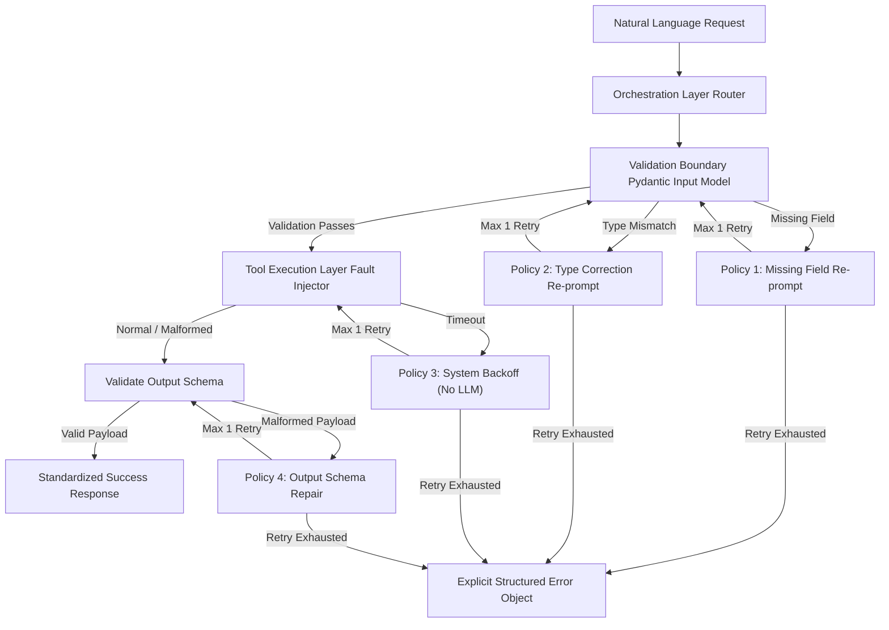

# AI Function-Calling Router with Injected-Failure Recovery

A production-grade function-calling orchestration layer built with **Pydantic** and **Python** that recovers from specific tool-execution failures (missing fields, type mismatches, network timeouts, and malformed tool responses).

This repository features **4 targeted recovery policies**, a **fault injection middleware** for deterministic chaos testing, a **batch evaluation harness** (`evaluate_router.py`), and full **Docker containerization** (`docker-compose up`).

---

## 📐 System Architecture



---

## 🌟 Key Features & Targeted Recovery Policies

| Failure Class | Injected Cause / Trigger | Policy Implementation | Retry Constraint |
| --- | --- | --- | --- |
| **1. Missing Field** | LLM omits mandatory input parameter (e.g. `date` missing from `FlightSearch`). | Extracts `loc` from `ValidationError`. Issues narrow prompt: *"The tool FlightSearch is missing 'date'. Based on request, extract only the missing value."* | Bounded to 1 retry. Returns `missing_field_unrecoverable` if failed. |
| **2. Wrong Data Type** | LLM provides relative date string `"tomorrow"` instead of ISO `YYYY-MM-DD`. | Issues type correction prompt: *"Today's date is 2026-09-20. Translate 'tomorrow' into ISO format YYYY-MM-DD."* | Bounded to 1 retry. Returns `type_error_unrecoverable` if failed. |
| **3. Upstream Timeout** | Upstream API times out (simulated by `FaultContext.current_fault = 'TIMEOUT'`). | **Zero LLM tokens spent.** Intercepts `TimeoutError`, applies native 0.1s backoff, and directly re-invokes Python tool function. | Bounded to 1 retry. Returns `timeout_unrecoverable` if failed. |
| **4. Malformed Response** | Upstream tool returns corrupted payload violating output schema (`'MALFORMED'`). | Prompts LLM to map/repair raw corrupted string into expected output Pydantic JSON schema. | Bounded to 1 retry. Returns `schema_repair_unrecoverable` if failed. |

---

## 🛠 Tool Schemas (`src/tools.py`)

1. **`FlightSearch`**:
   - *Input*: `origin` (str), `destination` (str), `date` (ISO date `YYYY-MM-DD`).
   - *Output*: `status` (str), `flight_id` (str), `origin`, `destination`, `date`, `price` (float).
2. **`CalendarBooking`**:
   - *Input*: `event_title` (str), `start_time` (ISO datetime), `duration_minutes` (int `>0`).
   - *Output*: `status` (str), `booking_id` (str), `event_title`, `start_time`, `duration_minutes`.
3. **`WeatherLookup`**:
   - *Input*: `location` (str), `unit` (Enum: `'C'` or `'F'`).
   - *Output*: `status` (str), `location`, `temperature` (float), `unit`, `condition`.
4. **`UnitConversion`**:
   - *Input*: `value` (float), `from_unit` (str), `to_unit` (str).
   - *Output*: `status` (str), `converted_value` (float), `from_unit`, `to_unit`.

---

## 📊 Batch Evaluation & Metrics (`output/metrics.json`)

Running `evaluate_router.py` processes 50 queries across two passes (Baseline vs. Recovery Active):

```json
{
  "baseline": {
    "completion_rate": 0.06,
    "silent_wrong_rate": 0.02,
    "mean_recovery_attempts": 0.0
  },
  "recovery_active": {
    "completion_rate": 0.76,
    "silent_wrong_rate": 0.0,
    "mean_recovery_attempts": 0.84
  }
}
```

- **Completion Rate**: Jumped from **6%** (baseline) to **76%** (recovery active).
- **Silent Wrong Rate**: Driven down to **0%** in recovery active mode (guaranteeing schema compliance).

---

## 🚀 Quick Start & Reproduction

### Option A: Via Docker Compose (Recommended)
Run the entire evaluation suite in containerized mode with a single command:

```bash
docker-compose up --build
```
This builds the image, runs `evaluate_router.py`, and writes results to `./output/metrics.json`.

### Option B: Local Python Execution

1. Install dependencies:
   ```bash
   pip install -r requirements.txt
   ```

2. Copy environment variable template:
   ```bash
   cp .env.example .env
   ```

3. Run batch evaluation harness:
   ```bash
   python evaluate_router.py
   ```

4. Run unit test suite:
   ```bash
   python -m pytest tests/
   ```

---

## 📁 Repository Structure

```
.
├── Dockerfile              # Container definition for evaluation harness
├── docker-compose.yml     # Compose configuration mounting ./output volume
├── .env.example           # Environment variables documentation
├── requirements.txt       # Pinned Python dependencies
├── evaluate_router.py     # Batch evaluation harness (req-9-evaluation-script)
├── data/
│   └── eval.jsonl         # 50 test cases dataset
├── output/
│   └── metrics.json       # Generated evaluation metrics (req-9 contract)
├── src/
│   ├── __init__.py
│   ├── tools.py           # Pydantic schemas & mock tools (req-1-schemas)
│   ├── fault_injector.py  # FaultContext & @inject_fault decorator (req-2-fault-injector)
│   └── router.py          # Router & 4 Targeted Recovery Policies (req-3 to req-8)
└── tests/
    └── test_router.py     # Pytest unit & contract test suite
```
